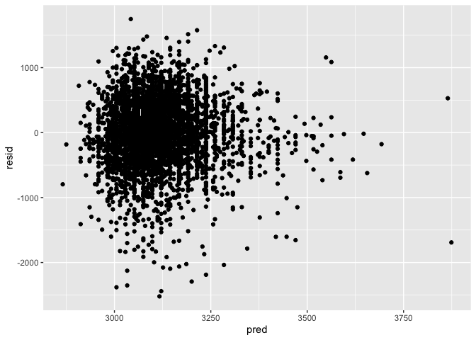
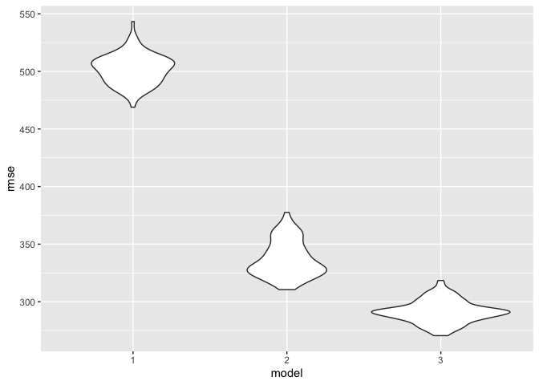

p8105_hw6_fz2328
================
Fengdi Zhang
2022-12-02

## Problem 2

Import Data:

``` r
homicides_US = read_csv("data/homicide-data.csv") %>% 
  janitor::clean_names() 
```

Create a `city_state` variable, and a binary variable indicating whether
the homicide is solved.

``` r
homicides_US = 
  homicides_US %>% 
  mutate(
    city_state = str_c(city, state, sep = ","),
    solved = ifelse(disposition == "Closed by arrest", 1, 0)
    )
```

Omit cities Dallas, TX; Phoenix, AZ; Kansas City, MO; and Tulsa, AL.
Limit analysis to those who are black or white. Convert `victim_age` to
numeric.

``` r
homicides_US = 
  homicides_US %>% 
  filter(city_state != "Dallas,TX" &
         city_state != "Phoenix,AZ" &
         city_state != "Kansas City,MO" &
         city_state != "Tulsa,AL") %>% 
  filter(victim_race == "White" | victim_race == "Black") %>% 
  mutate(victim_age = as.numeric(victim_age))
```

Fit a logistic regression with resolved vs unresolved as the outcome and
victim age, sex and race as predictors

``` r
Baltimore_logistic = 
  homicides_US %>% 
  filter(city_state == "Baltimore,MD") %>% 
  glm(solved ~ victim_age + victim_race + victim_sex, data = ., family = binomial()) 
```

Obtain the estimate and confidence interval of the adjusted odds ratio
for solving homicides comparing male victims to female victims keeping
all other variables fixed.

``` r
Baltimore_logistic %>% 
  broom::tidy() %>% 
  mutate(OR = exp(estimate),
         CI_lower = exp(estimate - 1.96 * std.error),
         CI_upper = exp(estimate + 1.96 * std.error)) %>%
  select(term, OR, CI_lower, CI_upper) %>% 
  filter(term == "victim_sexMale") %>% 
  knitr::kable(digits = 3)
```

| term           |    OR | CI_lower | CI_upper |
|:---------------|------:|---------:|---------:|
| victim_sexMale | 0.426 |    0.325 |    0.558 |

Repeat the above steps for each of the cities in the dataset.

First, create a function to fit a logistic model, and extract the
adjusted odds ratio (and CI) for solving homicides comparing male
victims to female victims

``` r
OR_and_CI = function(df) {
  fit_logistic = 
    df %>% 
    glm(solved ~ victim_age + victim_race + victim_sex, data = ., family = binomial())

  OR_and_CI = fit_logistic %>% 
    broom::tidy() %>% 
    mutate(OR = exp(estimate),
         CI_lower = exp(estimate - 1.96 * std.error),
         CI_upper = exp(estimate + 1.96 * std.error)) %>%
    select(term, OR, CI_lower, CI_upper) %>% 
    filter(term == "victim_sexMale")
  
}
```

Then, map it over the all the cities.

``` r
homicides_city =   
  homicides_US %>% 
  select(city_state, solved, victim_race, victim_age, victim_sex) %>% 
  nest(data = solved:victim_sex) %>% 
  mutate(OR_and_CI = map(data, OR_and_CI)) %>% 
  unnest(OR_and_CI) %>% 
  select(city_state, OR, CI_lower, CI_upper)
```

Create a plot that shows the estimated ORs and CIs for each city.

``` r
homicides_city %>% 
  mutate(city_state = fct_reorder(city_state, OR)) %>%  
  ggplot(aes(x = city_state, y = OR)) + 
  geom_point() +
  geom_errorbar(aes(ymin = CI_lower, ymax = CI_upper), width = 1) + 
  theme(axis.text.x = element_text(angle = 90, vjust = 0.7))
```

<!-- -->

From the plot, we can see that most cities have OR estimates to be lower
than 1, meaning that the odds for solved homicides among males are lower
than the odds among females for most cities, adjusting for all other
variables. The OR estimates are above 1 for Atlanta,GA; Richmond,VA;
Nashville,TN; Fresno,CA; Stockton,CA; and Albuquerque,NM. The 95% CI of
OR for Richmond,VA;Fresno,CA; Stockton,CA; and Albuquerque,NM exceeded
2, while the 95% CI of IR for all the other cities stayed below 2.

## Problem 3

Import Data:

``` r
birthweight = read_csv("data/birthweight.csv") %>% 
  janitor::clean_names() 
```

Convert categorical variables from numeric to factor

``` r
birthweight = 
  birthweight %>% 
  mutate(
    babysex = as.factor(babysex),
    frace = as.factor(frace),
    malform = as.factor(malform),
    mrace = as.factor(mrace)
  )
```

Construct a linear model between birthweight and mother’s pre-pregnancy
weight (pounds). We will propose that baby’s birthweight will increase
as mother’s pre-pregnancy weight increase.

``` r
bwt_ppwt_linear = lm(bwt ~ ppwt, data = birthweight)
```

Let’s look at the plot of model residuals against fitted values.

``` r
birthweight %>% 
  add_predictions(bwt_ppwt_linear) %>% 
  ggplot(aes(x = ppwt, y = bwt)) + geom_point() + 
  geom_line(aes(y = pred), color = "red")
```

<!-- -->

Now, let’s compare the self-constructed model to another 2 models.  
First, Let’s make a cross-validation test and training dataframe.

``` r
cv_df = 
  crossv_mc(birthweight, 100) %>% 
   mutate(
    train = map(train, as_tibble),
    test = map(test, as_tibble))
```

Then, let’s create the 3 models and calculate the `rmse`.

``` r
cv_df = 
  cv_df %>% 
  mutate(
    model1 = map(train, ~lm(bwt ~ ppwt, data = .x)),
    model2 = map(train, ~lm(bwt ~ blength + gaweeks, data = .x)),
    model3 = map(train, ~lm(bwt ~ bhead + blength + babysex + 
                  bhead*blength + blength*babysex + bhead* babysex +
                  bhead*blength*babysex, 
                  data = .x))
    ) %>% 
  mutate(
    rmse_1 = map2_dbl(model1, test, ~rmse(model = .x, data = .y)),
    rmse_2 = map2_dbl(model2, test, ~rmse(model = .x, data = .y)),
    rmse_3 = map2_dbl(model3, test, ~rmse(model = .x, data = .y)))
```

Make a violin graph to compare the rmse values for the three models.

``` r
cv_df %>% 
  select(starts_with("rmse")) %>% 
  pivot_longer(
    everything(),
    names_to = "model", 
    values_to = "rmse",
    names_prefix = "rmse_") %>% 
  mutate(model = fct_inorder(model)) %>% 
  ggplot(aes(x = model, y = rmse)) + geom_violin()
```

<!-- -->

From this graph, we can tell that the third model has the lowest rmse
estimates，meaning that it has a more valid prediction than the other 2
models.
